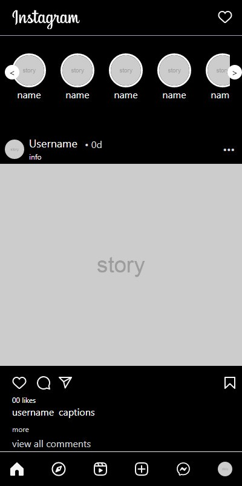

# Instagram-Clone
Instagram clone using tailwind CSS 
 

First project for practicing tailwind cspags   

View site - https://insta-clone-mg.netlify.app   

Still under developemnet

# Preview of the Page

<blackquote>

</blackquote>

# Remaining tasks

1 - explore page  

2- messsage chat page  

3- profile page  

4- reels page   

6- make login page  
make working arrow btn baside ig logo in home page  
post btn baside notificaion btn  

7- make it function al  

